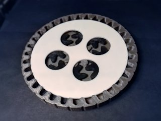
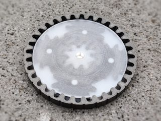
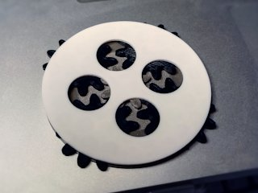
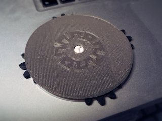

# Planetary Gear Coaster
*3D printable epicyclic gear set that can be used as a coaster or just as a fidget toy (formerly thing:2170550)*

### License
[Creative Commons - Attribution - Share Alike](https://creativecommons.org/licenses/by-sa/4.0/)

### Gallery

[🔎](images/photo1.jpg) [🔎](images/photo2.jpg) [🔎](images/photo3.jpg) [🔎](images/photo4.jpg)

## Description and Instructions

Inspired by [Jangles1981's gear coaster](http://www.thingiverse.com/thing:1828298), this is a variation with planetary (epicyclic) gears. The top and bottom rotate relative to each other, with 4 planet gears attached to one side and driven by a sun gear at the other side.

An optional outer ring can be added, which is not only useful to prevent your glass or cup from sliding off the coaster, but it also turns the coaster into a complete gearbox with a ratio of 5:1 between the outer disks.

There are 3 variations for each disk: ‘1’ has my logo stamped into it; ‘2’ has holes to reveal the inner gears (useful if you have no transparent filament); and ‘3’ is just a plain disk to which you can apply your own design if you wish.

The inner assembly can be placed either way inside the outer ring, but best is to put the sun gear disk on top, which makes it much easier to spin because of the 5:1 reduction w.r.t. the carrier disk.

Here's a [video](https://youtu.be/kvAJooTW0po) of the inner parts in action.

### Printing

Any material will do, although PLA may deform if you put really hot things onto the coaster. I used ABS just to be sure. A transparent filament for the top plate can offer a better view of the insides.

Print one ‘carrier’ and one ‘sun’ plate of your choice, and print the gear four times. 

This needs to be printed accurately for it to run smoothly, although you can compensate for imperfections by spending some time on sanding the finished parts.

All parts can be printed at 0.2 mm layers, but for the sun gear plate it may be better to use 0.1 mm to ensure the center axle is both strong and accurate. For instance I printed this in ABS, and this part proved too weak in 0.2 mm layers (although this could also have been due to the fact that I was still a relative n00b at that time).

Everything should fit together easily, although you may need to ream the holes in the gears if your first layer is squashed too much. The hole should be 5 mm. If you print it strong enough, it should be possible to easily take it apart for cleaning.

### Post-printing
The minimum you will probably want to do, is sand the planet gears to give them a smooth top and bottom surface. Depending on how accurate you printed this, the other parts may also require a bit of sanding. A simple trick is to pour abrasive cleaner (Cif or the like) with a bit of water into the assembly, and spin it in both directions for a while. This will automatically sand the parts where most needed, and make it run very smoothly. Rinse and dry afterwards.

## Updates

### 2017/03/12
First published on Thingiverse.

### 2017/04/02
Added outer ring.

### 2021/11/20
Migrated to GitHub, added more variations.

## TAGS
`beverage coaster`, `coaster`, `cog`, `drink coaster`, `engineering`, `fidget`, `Fidget Toy`, `Gear`, `gears`, `involute`, `mechanical`, `Planetary Gear`, `toy`